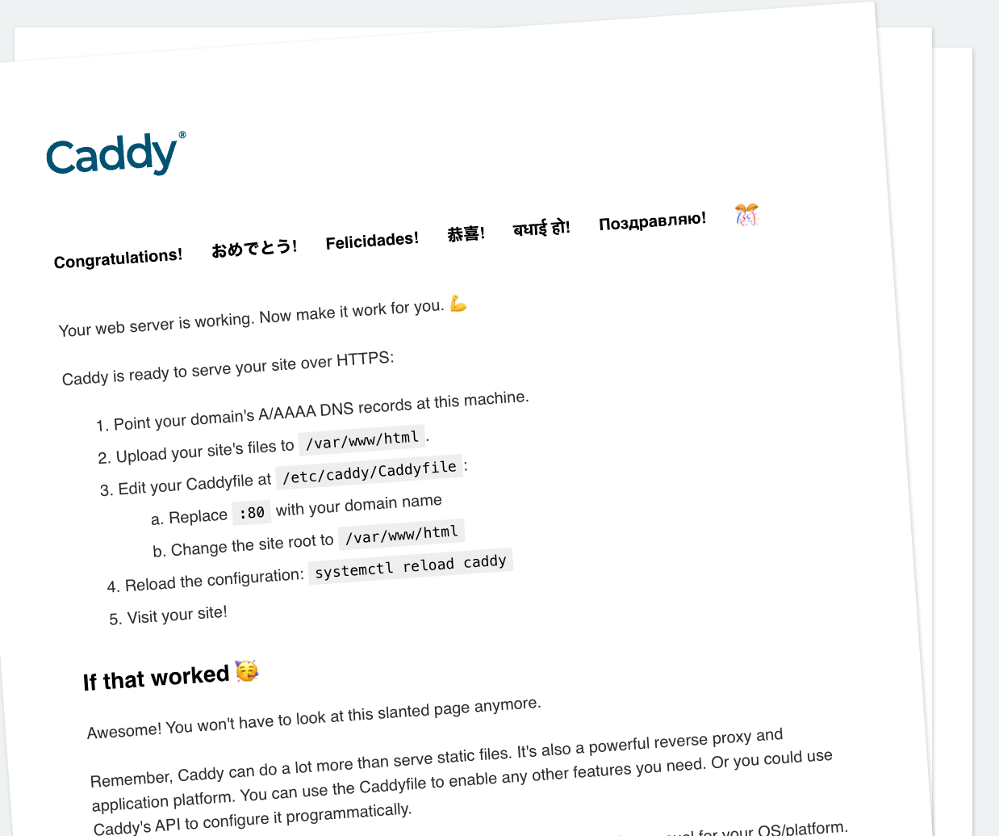

# Getting Started with Terraform

[Terraform][tf] is a developer-friendly tool that allows you to create identical production-ready deployments on multiple infrastructures regardless of their many vast differences in APIs, concepts, and abstractions.

Imagine how challenging it would be to create the same complex application deployment with an HTTP cache, horizontally-scalable application server cluster (e.g. Ruby, Python, Java, etc.), relational database cluster, memory cache server, TCP proxy, and so on between Azure, AWS, GCP, and Oracle, using nothing but code and those platform's APIs. Terraform makes that possible with a single [configuration language][hcl] and [CLI][cli].

This guide will get you started by deploying Caddy (an HTTP server) on an existing Docker host. You will:

1. Define your **provider** (the docker host),
1. Define what you want, your **resource** (the Caddy deployment),
1. Evaluate your changes before executing them with `terraform plan`, and;
1. Execute changes and apply variables at deploy time with `terraform apply`.

When finished, you will be able to see Caddy running its demo page successfully.

## Prerequisites

Before continuing, please be sure you have:

1. A working Docker environment (either on your local machine or a working Docker host on the network)
   - [Installation Instructions for Docker Desktop][dd-install]
   - [Installation Instructions for Docker Engine][de-install]
1. A working [Terraform][tf-install] installation
   - [Installation Instructions for Terraform][tf-install]

### Tips:

1. [Multicast-DNS][mdns] (mDNS/Bonjour/Avahi) may fail to resolve over Terraform for a variety of reasons. We recommend using a regular IP address in local dev/test environments, or setting up full, officially resolvable DNS hostnames with a proper DNS server. (We do not recommend use of mDNS in production environments for performance reasons.)
1. If you use a remote Docker host, instead of a socket on your local machine, remember to export the `DOCKER_HOST` environment variable before running any local `docker` CLI commands if you need to debug things (e.g. `export DOCKER_HOST="192.168.1.123"`).
1. Our use of Docker in this guide is merely for educational purposes and convenience to people getting started. Terraform's [providers][providers] architecture makes it capable of far more complex use cases and scenarios.
1. If your text editor of choice does not natively support [HCL][hcl] ("Hashicorp Configuration Language") syntax highlighting, look for an extension that would enable that feature. Most major text editors have native support for HCL syntax highlighting, or an open source extension that can enable it.
1. Throughout this tutorial you may see deprecation warnings about the use of "latest"; so long as this does not cause anything to totally break or refuse to proceed, you should be OK to continue. Use of "latest" in some providers may be deprecated to discourage bad _production_ practices of relying on "latest" to automatically pull in updates that may be untested in live production environments, but with this being a developer tutorial, "latest" is reasonably appropriate. Just know that in a real production environment you would use a specific version number instead, and keep that up to date going forward with regular validation and testing in an ideal situation.

## Create a Terraform Configuration File

To get started, create a new plain text file on your computer in an empty directory of your choosing (e.g. `$HOME/Projects/terraform-demo/`). Call this file `main.tf`.

```shell
$ touch main.tf
````

Open this file in your text editor of choice and add the following code:

```hcl
# main.tf
terraform {
  required_providers {
    docker = {
      source  = "kreuzwerker/docker"
      version = "~> 2.13.0"
    }
  }
}

provider "docker" {
  # If talking to a pre-configured host over the network (change to appropriate IP/port):
  host = "tcp://192.168.1.126:2375"
  # Or if a local unix socket, you can leave this entire block blank
  # (just comment the above line)
}
```

In the same directory, create another plain-text file, this one called `caddy.tf`:

```hcl
# caddy.tf
resource "docker_image" "caddy" {
  name         = "caddy:latest"
  keep_locally = false
}

resource "docker_container" "caddy" {
  image = docker_image.caddy.latest
  name  = "caddy-tutorial"
  ports {
    internal = 80
    external = 8080
  }
}
```

Save both files to disk.

> TIP: The [Docker Terraform Provider Registry Page][docker-tf-reg] is your best place to find links to source code and documentation for the Docker provider interface. The same is true for other related provider interfaces within the Terraform ecosystem.

#### Discussion

While you could certainly combine these into a single file for convenience, the purpose of splitting them here is to demonstrate that Terraform will load _all_ files in the current directory ending in `*.tf` at runtime, and that you can use this behavior to structure your projects to your liking. In this case the `caddy.tf` file pertains specifically to the _Caddy_ resource/service you plan to deploy, but in a real production scenario you may have dozens, potentially even hundreds of complex differing services throughout a project. Keeping all of those in one single file quickly becomes far too complex to manage, so splitting them up in different ways, across different files, allows you the flexibility to manage your workflow in many different ways.

### Terraform Plan

It's always a good idea to double check your work before making changes to a live production environment. That's why `terraform plan` exists. With this command, Terraform checks the _existing_ state of things against what you declared things _should_ look like in your `*.tf` files in the current directory. Terraform will then display a list of what it will have to change in order to make reality match your desired outcome as defined in your Terraform configuration files.

In the current directory, run the following command:

```shell
$ terraform plan
```

You should see something like this:

```
Terraform used the selected providers to generate the following execution plan. Resource actions are indicated with the following symbols:
  + create

Terraform will perform the following actions:

  # docker_container.caddy will be created
  + resource "docker_container" "caddy" {
      + attach           = false
      + bridge           = (known after apply)
      + command          = (known after apply)
      + container_logs   = (known after apply)
      + entrypoint       = (known after apply)
      + env              = (known after apply)
      + exit_code        = (known after apply)
      + gateway          = (known after apply)
      + hostname         = (known after apply)
      + id               = (known after apply)
      + image            = (known after apply)
      + init             = (known after apply)
      + ip_address       = (known after apply)
      + ip_prefix_length = (known after apply)
      + ipc_mode         = (known after apply)
      + log_driver       = "json-file"
      + logs             = false
      + must_run         = true
      + name             = "caddy-tutorial"
      + network_data     = (known after apply)
      + read_only        = false
      + remove_volumes   = true
      + restart          = "no"
      + rm               = false
      + security_opts    = (known after apply)
      + shm_size         = (known after apply)
      + start            = true
      + stdin_open       = false
      + tty              = false

      + healthcheck {
          + interval     = (known after apply)
          + retries      = (known after apply)
          + start_period = (known after apply)
          + test         = (known after apply)
          + timeout      = (known after apply)
        }

      + labels {
          + label = (known after apply)
          + value = (known after apply)
        }

      + ports {
          + external = 8080
          + internal = 80
          + ip       = "0.0.0.0"
          + protocol = "tcp"
        }
    }

  # docker_image.caddy will be created
  + resource "docker_image" "caddy" {
      + id           = (known after apply)
      + keep_locally = false
      + latest       = (known after apply)
      + name         = "caddy:latest"
      + output       = (known after apply)
      + repo_digest  = (known after apply)
    }
```

**The purpose of `plan` is to help you catch a mistake BEFORE it happens, so lean on it heavily!**

Here we see roughly what we expect - that it plans to create several new resources at the provider (our Docker host). That makes sense in this context; let's move on.

### Terraform Apply

In the same directory as before, run the following:

```shell
$ terraform apply
```

You should see output, once again, similar to the above, and an interactive prompt this time asking you if you want to proceed. Again, **please review this proposed list of changes very carefully**, especially in production environments! It's there to help you avoid accidental downtime!

Once you are satisfied everything is what you intend, type "yes" (all three letters) and press enter to continue. Terraform will dispatch commands to the provider in question (Docker, in this case) and if nothing unexpected happens, you will see a success message within a few seconds.

### Check It Out

With that done, visit the host on port 8080 and you will see the Caddy test web page:



## Add a Variable

That's all well and good, but wouldn't it be nice if you could change the exposed HTTP port for Caddy at the time of deployment? Well you can - with the addition of a _variable_.

But let's start from a blank slate, just to prevent yourself from accidentally overcomplicating things. To do that, you need to `terraform destroy`.

### Terraform Destroy

To clean up what you have created using Terraform, use the following command:

```shell
$ terraform destroy
```

This command will destroy the resources defined by your `*.tf` files within the present directory. This is essentially how you clean up after yourself when you're testing things prior to deploying to production.

After accepting the changes and removing unneeded resources, modify `caddy.tf` as follows.

### Modify `caddy.tf`

Open `caddy.tf` in your editor of choice and modify it as follows:

```hcl
# caddy.tf
resource "docker_image" "caddy" {
  name         = "caddy:latest"
  keep_locally = false
}

resource "docker_container" "caddy" {
  image = docker_image.caddy.latest
  name  = "caddy-tutorial"
  ports {
    internal = 80
    external = var.ext_http_port
  }
}
```

Note that only one line has been changed:

```hcl
    external = var.ext_http_port
```

Now, create another file, this one called `vars.tf`:

```hcl
# vars.tf
variable "ext_http_port" {
  description = "Port for host to accept HTTP traffic (external, insecure)"
  type        = number
  default     = 8080
}
```

Save all files to disk and again run `terraform plan`; you'll see, nothing has changed. Why? Because you haven't given it a different value for that variable, instead allowing Terraform to rely on the default you (very wisely) provided it. Let's do something about that.

### Terraform Apply - With a Variable

Next, run this:

```shell
$ terraform apply -var "ext_http_port=8888"
```

> You can use any port number you want here, so long as it is not already used on the host and is over number 1000 (security model limitation). We're just using 8888 for simplicity's sake.

Again, you will see essentially a "diff" and be asked to type 'yes'; do so and you can visit the same URL as before, but at the different port this time to see the Caddy test page. Alternatively, you can use `curl` via the terminal to get that web page:

```shell
$ curl http://localhost:8888
```

> Remember to substitute with the appropriate host name. If your Docker engine is running on your local machine, use `localhost`, otherwise use the IP address of the host that Docker is running on.

With this in mind, you can see how you might be able to make the Docker provider host a variable as well, or perhaps even which container image to use. Just note that the variable name on the command line will need to be a string, and _we do recommend wrapping it in quotes so that it isn't accidentally intercepted and interpreted by your shell before being passed to the `terraform` binary at runtime_.

## Next steps

As you can see, Terraform is a powerful tool for being able to make infrastructure changes with a single, declarative language. You've seen how "plan" can help you identify accidental resource deletion or creation, and how "apply" reinforces that safety net even further. Finally, you've seen how variables allow you to add flexibility into your workflow.

Terraform can do much, much more!

- Terraform has several _thousand_ providers available via the [Provider Registry][registry]
- The [Tutorials Home Page][tutorials] is a great starting point for finding tutorials specific to your needs
- View the [Terraform CLI Reference Documentation][cli-ref] for information on the Terraform CLI
- Visit the [Community Forum][forum] to browse and discuss Terraform with the community

[registry]: https://registry.terraform.io/browse/providers
[providers]: https://registry.terraform.io/browse/providers
[tf]: https://www.terraform.io
[hcl]: https://developer.hashicorp.com/terraform/language
[cli]: https://developer.hashicorp.com/terraform/cli
[dd-install]: https://docs.docker.com/desktop/
[de-install]: https://docs.docker.com/engine/install/
[tf-install]: https://developer.hashicorp.com/terraform/tutorials/aws-get-started/install-cli
[tf-plan]: https://developer.hashicorp.com/terraform/cli/run#planning
[mdns]: https://en.wikipedia.org/wiki/Multicast_DNS
[caddy]: https://caddyserver.com
[tutorials]: https://developer.hashicorp.com/terraform/tutorials
[cli-ref]: https://developer.hashicorp.com/terraform/cli
[forum]: https://discuss.hashicorp.com/c/terraform-core/27
[docker-tf-reg]: https://registry.terraform.io/providers/kreuzwerker/docker
